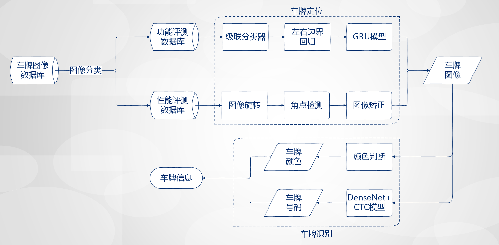

# Chinese License Plate Recognition

### 介绍

本项目被用于参加2018智慧城市技术挑战赛的车牌识别任务，其主要工作是基于深度学习完成的。

本项目主要分为车牌定位和车牌识别两大模块。在车牌定位模块使用了一些传统的图像处理方法和深度学习的方法共同完成；
在车牌识别部分采用了基于DenseNet的CTC(Connectionist Temporal Classification)模型进行车牌号码识别和一个深度网络分类器进行车牌颜色判断。

### 算法流程




### 依赖项

+ Ubuntu 16.04
+ Python 3.6
+ Keras (>2.0.0)
+ Tensorflow(>1.5.x)
+ Numpy (>1.10)
+ Scipy (0.19.1)
+ OpenCV(>3.0)
+ Scikit-image (0.13.0)
+ PIL


### 调用模型说明

+ cascade.xml  初步的车牌定位检测模型
+ model12.h5 左右边界回归模型
+ ocr_plate_all_gru.h5 基于GRU的序列模型，对车牌进行精确定位
+ plate_type.h5 用于车牌颜色判断的模型
+ weights_densenet_use_1.h5 用于识别功能评测图像库中的车牌的OCR模型
+ weights_densenet_use_2.h5 用于识别性能评测图像库中的车牌的OCR模型

### 代码使用说明

运行如下代码即可对测试集图片进行测试：

``` python inference.py --gpu_id <gpu_id> --dataroot <dataroot> ```

其中，gpu_id为使用的GPU序号，dataroot为测试集数据的根目录。

测试结果保存在```result.xlsx```中。
